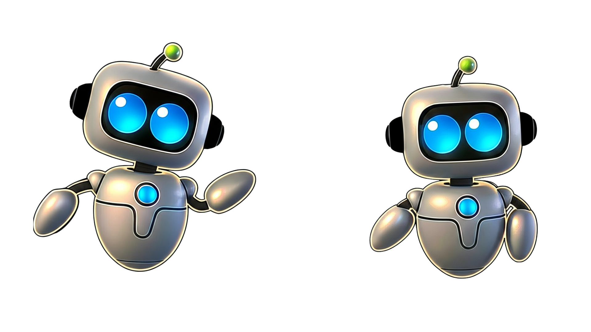

  

  <h1>Copa Ollin</h1>

  
Base documental para la plataforma web del torneo de robótica organizado por CROFI, en colaboración con Club Hello World.

  
<strong>Estado:</strong> pre-planeación · <strong>Evento:</strong> 5–7 de noviembre de 2026 · Ciudad Universitaria, CDMX

---

## Propósito

Este repositorio concentra los requisitos, reglamentos y recursos visuales entregados para preparar el desarrollo de la plataforma de Copa Ollin. Su objetivo actual es ofrecer una fuente de verdad revisable para la mesa directiva y el futuro equipo de trabajo.

Todavía **no se ha elegido stack, arquitectura, proveedor de despliegue ni metodología de trabajo por Sprints**. Las opciones técnicas mencionadas en los documentos fuente son propuestas que deberán validarse antes de comenzar la implementación.

## Alcance conocido

La plataforma deberá contemplar, como mínimo:

- Una landing page informativa, rápida y mobile-first.
- Presentación visual de las seis categorías y acceso a sus reglamentos.
- Una sección de premiación actualizable, inicialmente por confirmar.
- Registro de equipos, capitanes, integrantes y robots.
- Carga de comprobante de pago, identificación del capitán y carta responsiva.
- Aceptación de reglamentos, restricciones técnicas y uso de material audiovisual.
- Envío de datos y archivos a herramientas de Google Workspace, sujeto a validación técnica y de privacidad.
- Capacidad objetivo de hasta 500 usuarios concurrentes.

Consulta el [SRS normalizado](docs/requirements/especificaciones-tecnicas.md), el [kit de inicio sanitizado](docs/requirements/kit-de-inicio.md) y las [decisiones pendientes](docs/requirements/preguntas-abiertas.md).

## Categorías

| Categoría | Imagen | Reglamento | PDF original |
|---|---|---|---|
| Carrera de insectos | [PNG](assets/categories/carrera-de-insectos.png) | [Markdown](docs/regulations/carrera-de-insectos.md) | [PDF](docs/sources/regulations/carrera-de-insectos.pdf) |
| Micromouse amateur | [PNG](assets/categories/micromouse-amateur.png) | [Markdown](docs/regulations/micromouse-amateur.md) | [PDF](docs/sources/regulations/micromouse-amateur.pdf) |
| Minisumo amateur | [PNG](assets/categories/minisumo-amateur.png) | [Markdown](docs/regulations/minisumo-amateur.md) | [PDF](docs/sources/regulations/minisumo-amateur.pdf) |
| Minisumo profesional | [PNG](assets/categories/minisumo-profesional.png) | [Markdown](docs/regulations/minisumo-profesional.md) | [PDF](docs/sources/regulations/minisumo-profesional.pdf) |
| Seguidor de línea amateur | [PNG](assets/categories/seguidor-de-linea-amateur.png) | [Markdown](docs/regulations/seguidor-de-linea-amateur.md) | [PDF](docs/sources/regulations/seguidor-de-linea-amateur.pdf) |
| Seguidor de línea profesional | [PNG](assets/categories/seguidor-de-linea-profesional.png) | [Markdown](docs/regulations/seguidor-de-linea-profesional.md) | [PDF](docs/sources/regulations/seguidor-de-linea-profesional.pdf) |

## Registro solicitado

El kit entregado por CROFI solicita los siguientes grupos de datos:

- **Equipo:** nombre, categoría, institución y estado o ciudad de procedencia.
- **Capitán:** nombre completo, correo, teléfono e identificador institucional opcional.
- **Integrantes:** cantidad, nombres y correos opcionales.
- **Robot:** nombre y descripción de hasta 300 palabras.
- **Consentimientos:** reglamento, uso de imagen y cumplimiento de restricciones.
- **Archivos:** comprobante de pago, identificación del capitán y carta responsiva firmada.

Estos campos representan requisitos iniciales, no un contrato de API ni un esquema de almacenamiento aprobado. Antes de implementarlos deben resolverse las obligaciones de privacidad, acceso y retención documentadas en [preguntas abiertas](docs/requirements/preguntas-abiertas.md).

## Documentación y recursos

- [Índice documental](docs/README.md)
- [Especificaciones técnicas](docs/requirements/especificaciones-tecnicas.md)
- [Kit de inicio](docs/requirements/kit-de-inicio.md)
- [Preguntas abiertas](docs/requirements/preguntas-abiertas.md)
- [Guía de contribución](CONTRIBUTING.md)
- [Política de seguridad](SECURITY.md)
- [Recursos de marca](assets/README.md)
- [Instrucciones para agentes de IA](AGENTS.md) y [adaptador para Claude Code](CLAUDE.md)

## Colaborar

El proyecto utiliza un GitHub Flow ligero: cada cambio parte de un issue acotado, se desarrolla en una rama corta y llega a `main` mediante pull request con al menos una revisión. Lee [CONTRIBUTING.md](CONTRIBUTING.md) antes de participar.

No publiques credenciales, identificaciones, teléfonos, datos de participantes ni enlaces operativos de Google Workspace en commits, issues o pull requests.

## Licencia y derechos

El código fuente que se incorpore al proyecto se ofrece bajo la [licencia MIT](LICENSE). Los logotipos, imágenes, reglamentos, textos institucionales y demás materiales documentales quedan excluidos de esa licencia; consulta [NOTICE.md](NOTICE.md).

---

  Una colaboración de <strong>CROFI</strong> y <strong>Club Hello World</strong> · UNAM · 2026

