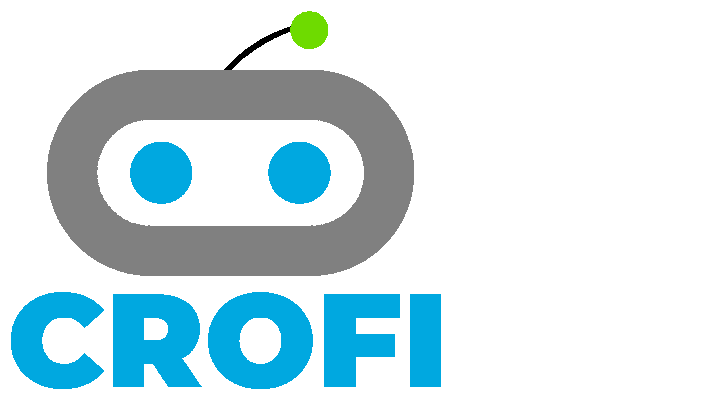
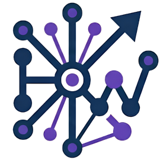

<div align="center">
  <p>
    
    &nbsp;&nbsp;&nbsp;
    
    &nbsp;&nbsp;&nbsp;
    
  </p>

  <h1>Copa Ollin</h1>

  <p>Plataforma web informativa y de registro para el torneo de robótica de CROFI, desarrollada en colaboración con Club Hello World.</p>

  <p><strong>Evento:</strong> 5–7 de noviembre de 2026 · Ciudad Universitaria, CDMX</p>
  <p><strong>Desarrollo:</strong> 14 de septiembre–11 de octubre de 2026 · F0–F7 operativas</p>

  <p>
    <a href="https://github.com/Hello-World-UNAM/copa-ollin-web/actions/workflows/quality.yml"></a>
    <a href="https://github.com/Hello-World-UNAM/copa-ollin-web/actions/workflows/staging.yml"></a>
  </p>
</div>

## Accesos rápidos

- [Staging](https://copa-ollin-web.vercel.app): snapshot integrado de `main`, todavía con `noindex` y sólo datos ficticios.
- [Tablero de desarrollo](https://github.com/orgs/Hello-World-UNAM/projects/1): backlog, sprint actual y estado de cada tarea.
- [Requisitos](docs/requirements/especificaciones-tecnicas.md) y [decisiones pendientes](docs/requirements/preguntas-abiertas.md).
- [Sistema de diseño](DESIGN.md), [arquitectura](docs/architecture/README.md) y [flujo de trabajo](docs/workflow.md).

## Objetivo y alcance

El objetivo es entregar un sitio mobile-first con información del evento, seis categorías, reglamentos descargables y un registro seguro conectado a Google Sheets y Drive.

La salida es **condicionada**: el sitio informativo puede publicarse, pero el registro sólo se habilitará cuando CROFI cierre las decisiones P0–P3, apruebe contenido y privacidad, y se superen las pruebas de integración, seguridad y QA. No forman parte de estas cuatro semanas un panel administrativo, pagos en línea, aplicación móvil, analítica ni automatizaciones de correo no confirmadas.

## Plan de cuatro semanas

| Sprint | Fechas | Incremento verificable |
|---|---|---|
| 1 | 14–20 sep. | Landing y categorías navegables, reglamentos, CI/E2E base y spike restringido de Google con datos ficticios. |
| 2 | 21–27 sep. | Registro completo en sandbox, validación cliente/servidor y persistencia sin duplicados. |
| 3 | 28 sep.–4 oct. | Release candidate accesible, resiliente y con controles de privacidad, archivos e idempotencia. |
| 4 | 5–11 oct. | Regresión, prueba de carga, runbook, UAT y decisión formal de salida. |

Si el registro no supera el gate de lanzamiento, se publica únicamente la parte informativa. El éxito se mide por incrementos aceptados y evidencia real, no por cantidad de issues cerrados.

## Base técnica y operativa

- **F0–F5 · Aplicación:** Astro 6, TypeScript estricto, React 19 sólo para islas interactivas y Tailwind CSS 4; Node.js 22 y pnpm 11 fijados.
- **F6–F7 · Entrega:** GitHub Projects, rama `main` protegida, revisión cruzada, check único `quality`, squash merge y QA posterior al merge.
- **Staging:** Vercel central administrado por Hello World; se despliega automáticamente después de un `quality` verde en `main`.
- **Calidad:** Prettier, ESLint, Astro Check, Vitest y build. Playwright se incorpora en el Sprint 1.
- **Datos:** Google Sheets y Drive son una propuesta sujeta al spike, permisos institucionales, privacidad y límites de carga.

Consulta los [ADR aceptados](docs/architecture/decisions/) para conocer decisiones, consecuencias y asuntos diferidos.

## Desarrollo local

El proyecto fija Node.js 22.23.2 y pnpm 11.3.0. Con [nvm](https://github.com/nvm-sh/nvm) y Corepack, el arranque recomendado desde cero es:

```bash
git clone https://github.com/Hello-World-UNAM/copa-ollin-web.git
cd copa-ollin-web
nvm install
nvm use
corepack enable
corepack prepare pnpm@11.3.0 --activate
pnpm install --frozen-lockfile
pnpm dev
```

La aplicación estará disponible normalmente en `http://localhost:4321`. Confirma el entorno con `node --version` y `pnpm --version`; deben mostrar `v22.23.2` y `11.3.0`. Si una instalación anterior quedó incompleta, repárala después de seleccionar Node 22:

```bash
pnpm install --force --frozen-lockfile
```

No instales `node-addon-api` para corregir un error de `sharp`: ese mensaje indica que `sharp` intentó compilar contra el `libvips` del sistema y no que falte una dependencia del proyecto. Actualiza el repositorio, selecciona Node 22 y reinstala. Antes de solicitar revisión ejecuta:

```bash
pnpm format:check
pnpm lint
pnpm check
pnpm test
pnpm build
```

## Cómo colaborar

Cada cambio sigue `issue → rama corta → PR → revisión → squash merge → QA en staging`. El issue permanece abierto después del merge y sólo se cierra cuando Sebastián registra la aceptación del snapshot integrado.

Lee [CONTRIBUTING.md](CONTRIBUTING.md) antes de trabajar y [AGENTS.md](AGENTS.md) si utilizas un agente de IA. No publiques secretos, enlaces operativos ni datos reales de participantes; fixtures, pruebas y demostraciones deben ser completamente ficticios.

## Mapa del repositorio

| Ruta | Contenido |
|---|---|
| [`src/`](src/) | Aplicación Astro, componentes, datos y rutas. |
| [`docs/requirements/`](docs/requirements/) | Alcance, requisitos y preguntas P0–P4. |
| [`docs/regulations/`](docs/regulations/) | Reglamentos legibles de las seis categorías. |
| [`docs/sources/`](docs/sources/) | PDF originales; prevalecen ante discrepancias. |
| [`docs/architecture/`](docs/architecture/) | ADR, contratos y decisiones técnicas. |
| [`assets/`](assets/) | Marca e imágenes de categorías. |
| [`.github/`](.github/) | Plantillas, CI y despliegue de staging. |

## Licencia y derechos

El código fuente se distribuye bajo la [licencia MIT](LICENSE). Logotipos, imágenes, reglamentos y textos institucionales están excluidos; consulta [NOTICE.md](NOTICE.md).

---

<div align="center">
  <sub>Una colaboración de <strong>CROFI</strong> y <strong>Club Hello World</strong> · UNAM · 2026</sub>
</div>
