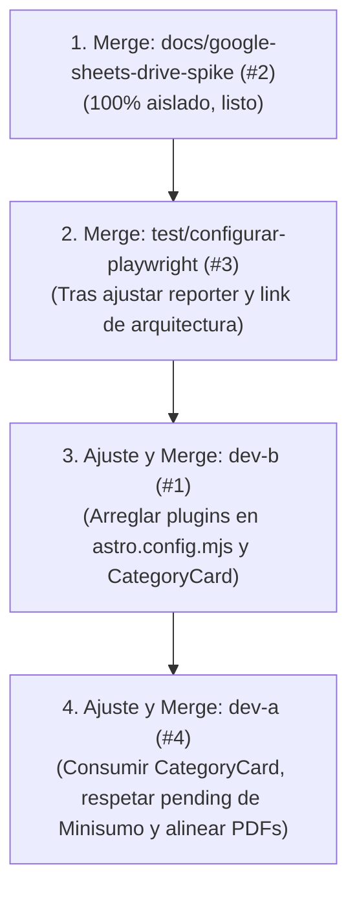

# Revisión Técnica del Sprint 1 y Retroalimentación para el Equipo

> **Contexto histórico:** Enrique Cano (`@kno4`) preparó esta revisión antes de la integración definitiva del Sprint 1. Conserva el diagnóstico de las ramas en ese momento; no representa por sí sola el estado actual de `main` ni sustituye el QA posterior al merge. Algunos hallazgos fueron corregidos durante la integración y la revisión final del sprint.

Este documento consolida la auditoría técnica exhaustiva de las cuatro ramas de trabajo correspondientes a los issues abiertos del **Sprint 1** en el repositorio `copa-ollin-web`.

Cada sección incluye el balance de cumplimiento respecto a los criterios de aceptación, los resultados de los comandos de validación obligatorios (`pnpm format:check`, `pnpm lint`, `pnpm check`, `pnpm test`, `pnpm build`, `pnpm test:e2e`) y un mensaje de **retroalimentación listo para copiar y enviar** a cada integrante.

---

## Tabla General de Estado

| Issue | Integrante | Rama | Criterios de Aceptación | Validaciones CI | Listo para Merge |
| :---: | :--- | :--- | :---: | :---: | :---: |
| **#1** | `@aleluflo06` | `dev-b` | ⚠️ Parcial | ❌ Fallan `format` y `lint` | ❌ Requiere corrección |
| **#2** | `@patyyv` | `docs/google-sheets-drive-spike` | ✅ 100% Cumplido | ✅ Pasan todas | ✅ **Listo para merge** |
| **#3** | `@rodrigo-past0r77` | `test/configurar-playwright` | ✅ Cumplido (con ajustes menores) | ✅ Pasan todas | ⚠️ Listo con ajustes menores |
| **#4** | `@alejandramucino` | `dev-a` | ⚠️ Parcial (suposición de requisitos y conflicto con #1) | ✅ Pasan todas | ⚠️ Requiere alineación con #1 y requisitos |

---

## 1. Issue #1 · @aleluflo06

- **Título:** Sprint 1 · Seis categorías, reglamentos Markdown y descargas PDF
- **Rama:** `dev-b` (Commit `35ca5b8`)

### Diagnóstico Técnico

1. **Astro Content Collections:** Implementó de forma excelente la colección `regulations` en `src/content.config.ts` utilizando el loader `glob` sobre `docs/regulations/`. Esto respeta la regla de no duplicar archivos.
2. **Pruebas unitarias:** Añadió un test en `src/data/categories.test.ts` que valida que cada una de las 6 categorías posea un Markdown en `docs/regulations/` y un PDF en `docs/sources/regulations/`.
3. **Fallo en Linter (Bloqueante de CI):** En `astro.config.mjs` declaró las funciones `shiftMarkdownHeadings` y `stripTranscriptionNotice`, pero no las registró dentro del objeto de configuración de Astro (`markdown.rehypePlugins`). ESLint falla por variables no utilizadas (`@typescript-eslint/no-unused-vars`).
4. **Accesibilidad y Enlace Roto:** Como las funciones rehype anteriores no se ejecutan:
   - La página `/categorias/[slug]` genera dos etiquetas `<h1>` (el de la plantilla y el del Markdown), rompiendo la jerarquía de encabezados de `DESIGN.md`.
   - El enlace de la transcripción editorial (`../sources/regulations/<slug>.pdf`) no se limpia y queda como un enlace relativo roto en el navegador.
5. **Componente no integrado:** Diseñó `src/components/categories/CategoryCard.astro` con imagen responsiva, etiqueta de pendiente para Minisumo y enlaces a PDF/detalle, pero **nunca lo importó ni lo utilizó en `src/pages/index.astro`**. La landing sigue mostrando los enlaces de texto provisionales antiguos ("Abrir cascarón de categoría").
6. **Formato:** Falló `prettier --check` en 4 archivos.

### Mensaje de Retroalimentación para @aleluflo06

```markdown
Hola @aleluflo06,

¡Gran trabajo con la integración de las colecciones de contenido de Astro y las pruebas en `categories.test.ts`! La estructura para renderizar los reglamentos Markdown directo desde `docs/regulations/` quedó muy limpia.

Antes de poder hacer merge de tu rama a `main`, necesitamos atender estos detalles para que pase el pipeline de CI y se cumpla el criterio de la landing:

1. **Conectar los plugins en `astro.config.mjs`:**
   Definiste muy bien las funciones `shiftMarkdownHeadings` y `stripTranscriptionNotice`, pero faltó registrarlas dentro de `defineConfig`. ESLint marca error por variables no utilizadas y, al no ejecutarse, la página de categoría genera dos `<h1>` (afectando la accesibilidad) y un enlace relativo roto en la transcripción.
   *Solución:* Agrégalas a la configuración:
   ```javascript
   export default defineConfig({
     adapter: vercel(),
     integrations: [react()],
     markdown: {
       rehypePlugins: [shiftMarkdownHeadings, stripTranscriptionNotice],
     },
   });
   ```

2. **Integrar `CategoryCard.astro` en la Landing (`src/pages/index.astro`):**
   Creaste un componente muy completo en `src/components/categories/CategoryCard.astro`, pero no se está usando en `src/pages/index.astro`. En la landing aún se ven los textos antiguos de "Abrir cascarón de categoría". Sustitúyelos por tu nuevo componente para que los enlaces, imágenes y el aviso de Minisumo funcionen directamente desde la página principal.

3. **Formato Prettier:**
   Corre `pnpm format` para corregir el estilo en `CategoryCard.astro`, `content.config.ts`, `[slug].astro` y `global.css`.

4. **Verificación local previa a push:**
   Confirma que todos los checks pasen con:
   ```bash
   pnpm format:check && pnpm lint && pnpm check && pnpm test && pnpm build
   ```

¡Con estos ajustes la rama quedará 100% lista para merge!
```

---

## 2. Issue #2 · @patyyv

- **Título:** Sprint 1 · Spike restringido de Google Sheets/Drive con datos ficticios y ADR
- **Rama:** `docs/google-sheets-drive-spike` (Commit `9a32510`)

### Diagnóstico Técnico

1. **Criterios de Aceptación:** Cumplidos al 100%. Redactó `docs/architecture/decisions/0003-google-sheets-drive-spike.md` con un estándar impecable.
2. **Seguridad y Privacidad:** Verificación exhaustiva: no incluyó tokens, credenciales, IDs reales de carpetas/hojas ni datos personales. Utilizó identificadores ficticios (`SPIKE-20260918-001`).
3. **Análisis de Arquitectura:** Documentó matriz de permisos por rol, revocación de accesos, continuidad operativa, riesgos (duplicados, falta de idempotencia nativa, cuotas) y las tres opciones de solución (A: Sheets/Drive directo, B: Capa intermedia de validación, C: Servicio de datos dedicado), estableciendo 10 condiciones previas a producción.
4. **Navegación Documental:** Enlazó correctamente el nuevo ADR desde `docs/architecture/README.md`.
5. **Validaciones de CI:**
   - `git diff --check`: ✅
   - `pnpm format:check`: ✅
   - `pnpm lint`: ✅
   - `pnpm check`: ✅
   - `pnpm test`: ✅
   - `pnpm build`: ✅

### Mensaje de Retroalimentación para @patyyv

```markdown
Hola @patyyv,

Revisamos tu entrega en la rama `docs/google-sheets-drive-spike` para el Issue #2 y está impecable.

Puntos a destacar:
- **Excelente manejo de seguridad:** Cero exposición de credenciales, IDs operativos ni datos personales. Las pruebas con el identificador ficticio `SPIKE-20260918-001` y la limpieza posterior están muy bien documentadas.
- **Rigor técnico:** El análisis de las opciones A, B y C, la advertencia sobre la falta de idempotencia en inserciones directas y los 10 requisitos previos para producción dejan una base clara para el Sprint 2.
- **Calidad de código y estilo:** Enlazaste el ADR en el README de arquitectura y pasaron limpios todos los comandos de CI (`pnpm format:check`, `pnpm lint`, `pnpm check`, `pnpm test`, `pnpm build`).

Tu rama está aprobada y lista para merge a `main`. ¡Muchas gracias por el trabajo!
```

---

## 3. Issue #3 · @rodrigo-past0r77

- **Título:** Sprint 1 · Playwright, mocks, smoke tests y contrato inicial del registro
- **Rama:** `test/configurar-playwright` (Commits `b9dc137`, `b7bcd68`, `f6b3584`)

### Diagnóstico Técnico

1. **Configuración de E2E:** Configuró Playwright de forma reproducible (`package.json`, `pnpm-lock.yaml`, `playwright.config.ts`), registrando el script `"test:e2e": "playwright test"`.
2. **Cobertura de Smoke Tests:** En `tests/smoke.spec.ts` cubrió:
   - Metatag `noindex, nofollow` en todas las rutas.
   - Status 200 en las 6 categorías.
   - Verificación de que `/registro` se mantiene en estado "en preparación", sin formularios ni inputs que puedan recibir datos sensibles.
   - Resiliencia simulando caída de red en recursos estáticos.
   - Los 8 tests ejecutados en Chromium y Firefox pasaron exitosamente.
3. **Contrato de Registro:** Creó `docs/architecture/contrato-registro-provisional.md` documentando campos conocidos y bloqueos normativos (P0-05, P0-06, P1-05 a P1-08) sin inventar esquemas definitivos.
4. **Detalles a pulir antes de merge:**
   - **Enlace en documentación:** Falta agregar el enlace a `contrato-registro-provisional.md` dentro de la sección `## Contratos internos` en `docs/architecture/README.md`.
   - **Reporter de Playwright:** En `playwright.config.ts`, `reporter: 'html'` inicia un servidor local en el puerto 9323 y no libera la terminal al terminar en modo no interactivo. Se debe configurar para que no abra el servidor automáticamente (`open: 'never'`) si no se solicita.
   - **Mensaje de commit:** El commit `f6b3584` tiene una errata en la referencia: `(Refs # 1` en lugar de `(Refs #3)`.

### Mensaje de Retroalimentación para @rodrigo-past0r77

```markdown
Hola @rodrigo-past0r77,

¡Excelente trabajo configurando Playwright y los smoke tests! La suite cubre con precisión los requisitos de noindex, la verificación de rutas y la validación de que el registro permanezca sin formularios interactivos.

Para dejar la rama lista para merge, por favor atiende estos dos detalles menores:

1. **Enlazar el contrato en el índice de arquitectura:**
   En `docs/architecture/README.md`, agrega el enlace a tu nuevo documento bajo la sección `## Contratos internos`:
   ```markdown
   - [Contrato provisional de registro](contrato-registro-provisional.md)
   ```

2. **Evitar que el reporter de Playwright bloquee la terminal:**
   En `playwright.config.ts`, `reporter: 'html'` arranca un servidor web al terminar las pruebas locales y deja la terminal en espera. Conviene configurarlo para que solo genere los archivos sin abrir el servidor:
   ```typescript
   reporter: [['html', { open: 'never' }]],
   ```

3. **Verificación final:**
   Confirma que corran:
   ```bash
   pnpm format:check && pnpm lint && pnpm check && pnpm test && pnpm build && pnpm test:e2e
   ```

¡Fuera de eso, la implementación está muy sólida!
```

---

## 4. Issue #4 · @alejandramucino

- **Título:** Sprint 1 · Landing informativa, contenido confirmado y responsive
- **Rama:** `dev-a` (Commits `1cf4dfc`, `f3b4670`)

### Diagnóstico Técnico

1. **Diseño y Mobile-First:** Maquetó la landing informativa con fechas del evento (5–7 nov 2026), sede (Edificio X Anexo de Ingeniería CU), estado de premiación en "Por confirmar", skip link y estilos responsive en `src/styles/global.css`.
2. **Validaciones de CI:** `pnpm format:check`, `pnpm lint`, `pnpm check`, `pnpm test`, `pnpm build` pasan sin errores.
3. **Puntos Críticos de Cumplimiento (Bloqueos normativos):**
   - **Suposición de decisiones de negocio:** En `docs/requirements/preguntas-abiertas.md` y `src/data/categories.ts`, dio por resueltas preguntas abiertas de CROFI (P0-02, P0-03 y P3-01) indicando "Decisiones recibidas el 18 de septiembre de 2026" y cambiando `nameStatus: 'confirmed'` para Minisumo Autónomo. De acuerdo con `AGENTS.md`, las decisiones pendientes no deben asumirse como confirmadas hasta contar con la validación explícita del Product Owner institucional.
   - **Incompatibilidad arquitectónica en PDFs con el Issue #1:** Creó un endpoint dinámico `src/pages/regulations/[slug].pdf.ts` para servir los PDF en `/regulations/<slug>.pdf` y cambió las URLs en `categories.ts`. En `main` y en la rama `dev-b` (`aleluflo06`), los PDFs se importan como assets estáticos mediante el plugin de Vite (`?url`). Esto creará conflictos al fusionar.
   - **Tarjetas de categoría en la landing:** En `src/pages/index.astro` renderizó tarjetas básicas con solo el título (`<h3>{category.workingName}</h3>`), sin imagen y sin enlace al PDF. En su lugar, el Issue #1 desarrolló `CategoryCard.astro` con imagen y enlaces completos. Lo ideal es usar ese componente para unificar la landing.

### Mensaje de Retroalimentación para @alejandramucino

```markdown
Hola @alejandramucino,

¡Muy buen avance con la maquetación de la landing! La estructura visual, el manejo responsive para pantallas pequeñas (<30rem), la accesibilidad de navegación y la sección de premiación en "Por confirmar" cumplen muy bien con los lineamientos de `DESIGN.md`.

Antes de realizar el merge, necesitamos alinear un par de puntos normativos y de coordinación técnica con el equipo:

1. **Estado de las preguntas abiertas (P0-03 y Minisumo):**
   En `docs/requirements/preguntas-abiertas.md` y `src/data/categories.ts`, se marcaron P0-02, P0-03 y P3-01 como resueltas ("Decisiones recibidas el 18 de septiembre"), y el estado de Minisumo como `confirmed`. Según las reglas de gobierno de `AGENTS.md`, no debemos dar por cerradas preguntas abiertas ni cambiar el estado a `confirmed` hasta que CROFI formalice la respuesta en el kickoff.
   *Sugerencia:* Mantener el estado en `pending-confirmation` y no alterar la tabla de preguntas abiertas como ya resuelta.

2. **Alineación de URLs de PDF con la rama de categorías:**
   Creaste un endpoint estático en `src/pages/regulations/[slug].pdf.ts` y cambiaste las rutas a `/regulations/<slug>.pdf`. Sin embargo, en `main` y en la rama `dev-b` (Issue #1) los PDFs se importan como activos estáticos con Vite (`?url`). Debemos unificar un solo criterio para evitar conflictos de merge y código duplicado.

3. **Integración con `CategoryCard.astro` (Issue #1):**
   En la sección `#categorias` de la landing, actualmente se muestran tarjetas con solo el título en texto. En la rama `dev-b` se creó `CategoryCard.astro` con la imagen optimizada, los enlaces al reglamento y la descarga del PDF. Conviene integrar ese componente en la landing para que la presentación quede completa y homogénea.

4. **Verificación de CI:**
   Asegúrate de que pasen:
   ```bash
   pnpm format:check && pnpm lint && pnpm check && pnpm test && pnpm build
   ```

¡Coordinando estos puntos con el equipo de categorías la landing quedará excelente!
```

---

## 5. Estrategia Sugerida de Integración (Orden de Merges)

Para evitar conflictos y resolver las dependencias sin fricciones, se recomienda el siguiente orden de integración:



1. **Paso 1:** Merge de **Issue #2** (`docs/google-sheets-drive-spike`): No genera ningún conflicto de código y sienta el ADR-0003.
2. **Paso 2:** Merge de **Issue #3** (`test/configurar-playwright`): Deja la suite de smoke tests activa para proteger futuras integraciones.
3. **Paso 3:** Corrección y merge de **Issue #1** (`dev-b`): Conecta las colecciones de contenido y el componente `CategoryCard`.
4. **Paso 4:** Actualización y merge de **Issue #4** (`dev-a`): Integra la landing final consumiendo el componente de categorías de `dev-b` y resolviendo la estrategia unificada de PDFs.
